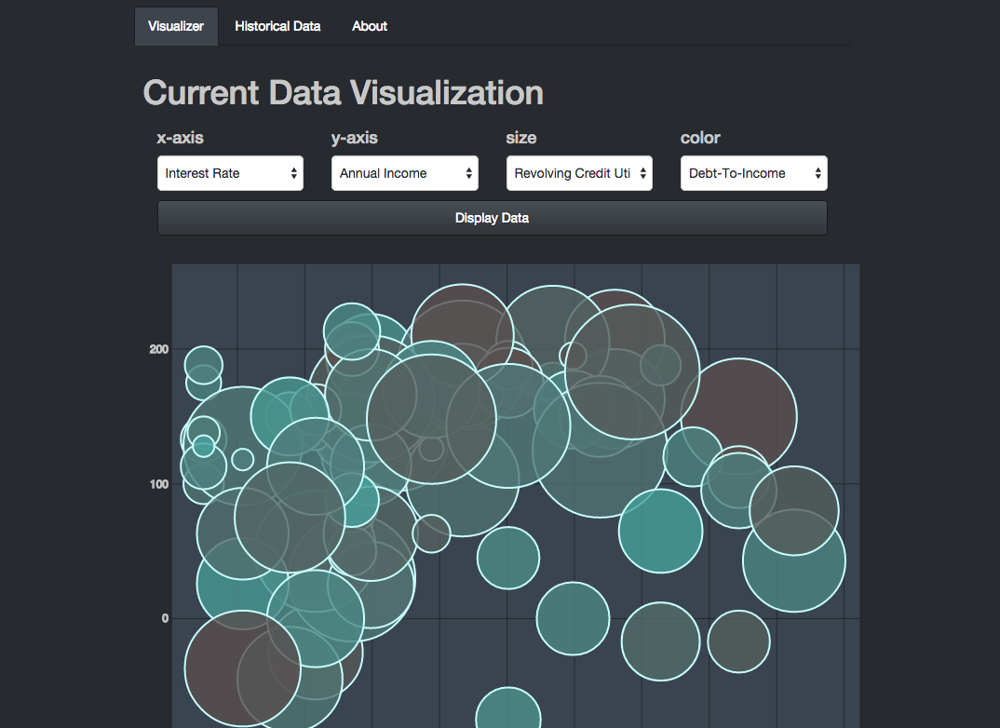

# Peer View (Lending Club Data Visualization)

Visualize current and historical investment data for lendingclub.com

### Vizualization View

### Back-end Data

Using a number of CSV files available at lendingclub.com:

- LoanStats3b_securev1.csv
- LoanStats3c_securev1.csv

As well as the [Lending Club API](https://www.lendingclub.com/developers/listed-loans.action) for currently available investments.

#### Version 2.0 Requirements To Be Finished

###### Server-Side

1. Create standard analysis of historical data
1. Create average scales for each data point
1. Send normalized data to client
